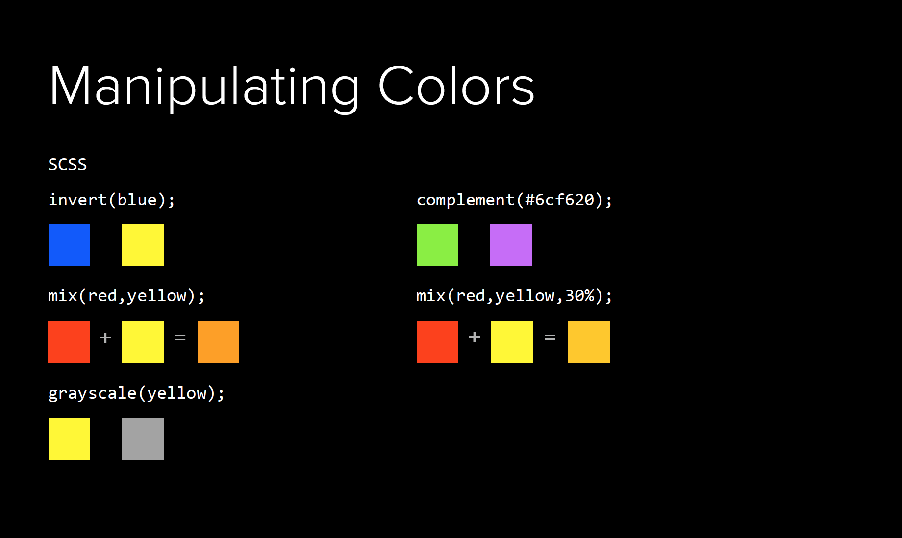
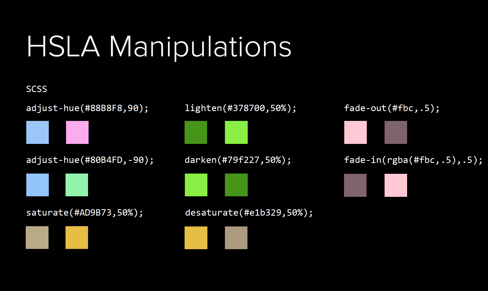

#    Sassy CSS!

## Objectives
- Use Sass variables to DRY CSS
- Use Sass nesting to make CSS more readable
- Use Sass functions to help with design 
- Use Sass import to help structure our CSS files 
- Use Sass mixins and extend to minimize the amount of CSS code we write

## What is Sass?
- Syntactically Awesome Style Sheets
- Written and maintained by Zurb, who also own the [Foundation framework](http://foundation.zurb.com/)
- Sass is a pre-processor for CSS, which means you write code in Sass and let Sass manage your CSS for you.
- Adds the power of math, variables, logic and more
- Makes writing CSS even _MORE_ fun than it already is!

## Installation

Sass is automatically installed with Rails so don't need to do much if you're using Rails. The only change you should need to make is to 
change ``application.css`` to ``application.scss``.

We'll cover how to add Sass to a Javascript app in a few weeks.

### Starter Code 
Clone the repo, download it, and make sure the app runs.

## What makes up Sass?

- Variables
- Nesting
- Functions
- @import
- Mixins
- @extend

## Variables

Sass enables you to use variables in your CSS. The has the huge result of making our CSS less complex by:

- Make code easier to change because they reduce duplication
- Name things by their intent and be more semantic

The basic syntax is 

``` css
/* Sass Variables syntax: */

$my-variable: value;

```

You can make variables of hex colors, sizes, strings, and even other variables! Sass let's you write code like this to 
make things easy to change.

``` css
/* Sass Variables syntax: */

$blue: #1d96bc;
$main-color: $blue;
```

Sass allows you to use variables inside of ``#{}`` like Ruby. Lets see how we can use this to standardize our media queries. 
Our small media query is 
```css
$small: "only screen and (max-width: 768px)";
```
let's add this to our ``welcome.scss`` file.
<details>
```css
@media #{$small} { 
    body {
        font-size: 16px;
    }
}

```
</details>

### Independent Practice.  

Lets make our links the main_color, ``#1d96bc``.

<details>
``` css
$main-color: #1d96bc;
a {
    color: $main-color;
}

```
</details>

## Nesting
One of the difficulties of CSS is that the CSS syntax doesn't match up with the way we think about the DOM. The CSS to 
style the ``<a>`` tag inside an ``<h1>`` tag is ``h1 a``. Sass lets us express this a bit more naturally as 
``` scss
h1 {
    a {
        /* Some selectors */ 
    }
}
```
This helps us minimize code complexity by

- Makes style sheets more readable
- No longer rewrite selectors over and over again

Some of the benefits can be lost if you over-nest so try to set a limit to nesting, 3 or 4 levels are good starting points.

Sass also gives us the ability to select the parent so we can use modifier selectors too: 
```scss
.table-row {
    &:first {
        background-color: grey;
    }
}
```

Sass also bubbles our media queries to the right place so we can write:
``` css
header {
    margin: 24px;
    @media only screen and (min-width: 768px) {
        margin: 20px;
    }
}

```
that compiles to 
``` css
header {
    margin: 24px;
}

@media only screen and (min-width: 768px) {
    header {
        margin: 20px;
    }
}

```

Let's style our headers a bit more. Let's make our ``h1`` font size ``1.4em`` and color ``#333333``. Let's make the links in 
headers only color ``#0022ff`` and remove the undeline.


<details>
``` scss
h1 {
    font-size: 1.4em;
    color: #333333;
    a {
        color: #0022ff; 
        text-decoration: none;
    }
}
```
</details>


### Independent Practice:
Let's make the links turn italic when you hover over them.

<details>
``` css
a {
    color: $main-color;
    
    &:hover {
        font-style: italic;
    }
}

```
</details>


If you need more complex CSS selectors check out the [Sass documentation](http://sass-lang.com/documentation/file.SASS_REFERENCE.html). 

## Functions
If we don't want to output CSS but we do want a value, we can use functions!
```css
/* Sass Function Syntax */
@function name($num,$num2) {
    @return $num + $num2
}

.my-module {
    padding: name($num,$num2);
}

```

Here's a common example to help make a layout more responsive but converting pixels to ems.
``` css
$em-base: 16px;

@function emCalc($px-width) {
    @return $px-width / $em-base * 1em;
}

h1 {
    font-size: emCalc(14px);
}

```
After compiling this gives:
``` css
h1 {
    font-size: .875em;
}

```

Here are some useful math functions that Sass includes.
``` css
percentage(13/25)   /* 52% */
round(2.4)          /* 2   */
ceil(2.2)           /* 3   */
floor(2.6)          /* 2   */
abs(-24)            /* 24  */
```

Sass also has useful color functions 





Here's some more [detail](http://jackiebalzer.com/color) on exactly what is happening with color functions, 

### Independent Practice
Write a function, ``column-size`` that takes a size in pixels and the number of columns and returns the appropriate column
size in pixels.

<details>
```css
@function colum-size($size,$cols) {
    @return $size / $cols
}
```
</details>

## @import
Lastly, we can put our CSS in seperate files and use that structure to help organize our code. For example, we can create a 
file for each of our controllers or a file that contains all of the colors in our app in a single file. We just need to use the import 
command in the ``application.scss`` file, the Rails asset pipline takes care of the rest.

## Mixins
Sass even gives you the ability to write macros or groups of CSS commands.

``` css
/* Sass Mixin Syntax: */

@mixin mixin-name($option) {
    /* ...css code... */
}

a {
    @include mixin-name;
}

```
When we compile the Sass file, all of the code from the mixin is copied into the CSS for the ``a`` tag.

``` css
@mixin border-radius($radius) {
    -webkit-border-radius: $radius;
    -moz-border-radius: $radius;
    -ms-border-radius: $radius;
    border-radius: $radius;
}

.button {
    background: black;
    color: white;
    padding: 10px 20px;
    @include border-radius(5px);
}

```

``` css
.button {
    background: black;
    color: white;
    padding: 10px 20px;
    -webkit-border-radius: 5px;
    -moz-border-radius: 5px;
    -ms-border-radius: 5px;
    border-radius: 5px;
}
```

Inside our mixin we can also use if statements. This can help make sure things like the font color work with the button 
color:

``` css
@mixin btn($bg) {
    $bg-lightness: lightness($bg);
    background-color: $bg;

    @if $bg-lightness > 70% { color: #333333; } 
    @else { color: #ffffff; }
}

.button {
    @include btn(#0000ff);
}
.button-alt {
    @include btn(#dddddd);
}

```

## @extend
If we think of a block of CSS more as base class than a group of related CSS commands you can use ``@extend`` instead of 
``@mixins``.  The extends command tries to write the CSS code once so you can't use any variables but your overall file size 
can be smaller.


```css
.message {
  border: 1px solid #ccc;
  padding: 10px;
  color: #333;
}

.success {
  @extend .message;
  border-color: green;
}

.error {
  @extend .message;
  border-color: red;
}

.warning {
  @extend .message;
  border-color: yellow;
}
```

## Conclusion

In conclusion, Sass is a great tool to help manage your CSS and make it more dynamic and powerful. Although it is not a requirement of this class to learn Sass, I hope some of you love it as much as I do. At very least, you've got this documentation to develop one more tool in your kit.

If you want more information check out the [Sassy Way](http://thesassway.com/) for a variety of tutorials.

## Licensing
All content is licensed under a CC­BY­NC­SA 4.0 license.
All software code is licensed under GNU GPLv3. For commercial use or alternative licensing, please contact legal@ga.co.
